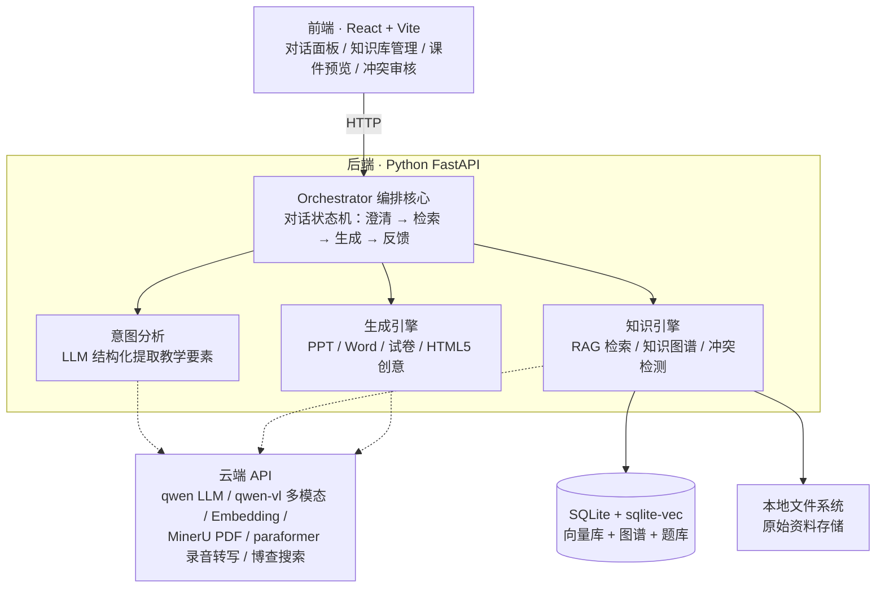

# EduMind — 多模态 AI 互动式教学智能体

以教师教学思路为核心驱动：教师用自然语言（语音/文字）多轮对话备课，系统主动追问澄清意图，融合本地知识库与知识图谱，一键生成 **PPT 课件 / Word 教案 / 教学提纲 / 试卷 / HTML5 互动内容**，并支持修改意见迭代再生成。

## 功能特性

- **多轮对话备课**——语音 + 文字输入，三档追问粒度（快速/标准/精细），主动澄清模糊需求
- **本地知识库**——PDF/Word/PPT/图片/视频/录音 六路解析管道，RAG 语义检索，参考资料溯源
- **知识图谱 + 冲突检测**——从资料自动提取知识点与四种关系（前置/包含/推导/相关），检测「定义冲突/结构冲突/常识存疑」进入教师待审队列
- **多样产物一键生成**——PPT（三套配色主题）/ Word 教案 / 提纲 / 试卷（自动入题库并标注考查知识点）/ HTML5 互动小游戏
- **迭代优化**——预览当前版本 → 修改意见 → 局部重排再生成 → 下载 .pptx / .docx
- **会话持久化**——多备课会话管理，刷新/重开浏览器完整恢复
- **本地零重依赖**——大模型/PDF 解析/录音转写全部走云端 API，不装 torch、不要 Docker；**无 API Key 时全链路 stub 模式可跑通**

## 系统架构



实线为本地调用，虚线为云端 API 调用——所有重依赖推至云端，本地零 torch、零 Docker。

## 快速开始

**前置依赖**：Python 3.11–3.12、Node.js ≥ 18，推荐安装 [uv](https://docs.astral.sh/uv/)（Python 包管理）。

```bash
git clone https://github.com/JulianZBY/EduMind.git
cd EduMind

# 后端依赖（生成 backend/.venv）
cd backend && uv sync && cd ..

# 前端依赖
cd frontend && npm install && cd ..

# 配置（可跳过：默认 stub 模式，无 Key 即可跑通）
cp backend/.env.example backend/.env    # Windows 用 copy
```

**启动**（开两个终端，Windows / macOS / Linux 命令一致）：

```bash
# 终端 1：后端（:8000）
cd backend && uv run uvicorn app.main:app --host 127.0.0.1 --port 8000

# 终端 2：前端（:5173）
cd frontend && npm run dev
```

浏览器访问 **http://localhost:5173**。

## 接入真实模型（可选）

复制 `backend/.env.example` 为 `backend/.env`，按需填入：

| 变量 | 用途 |
| --- | --- |
| `DASHSCOPE_API_KEY` | 阿里云百炼：qwen LLM / 多模态 / Embedding / paraformer 录音转写 |
| `DEEPSEEK_API_KEY` | DeepSeek（LLM 备选） |
| `SILICONFLOW_API_KEY` | SiliconFlow（Embedding 备选） |
| `MINERU_TOKEN` | MinerU 云端 PDF 解析 |
| `BOCHA_API_KEY` | 博查网络搜索 |

各 provider 由 `LLM_PROVIDER` / `ASR_PROVIDER` 切换，默认 `stub`（固定内容网关），保证无 Key 环境可跑通全部流程与测试。

## 运行测试

```bash
cd backend && uv run pytest
```

