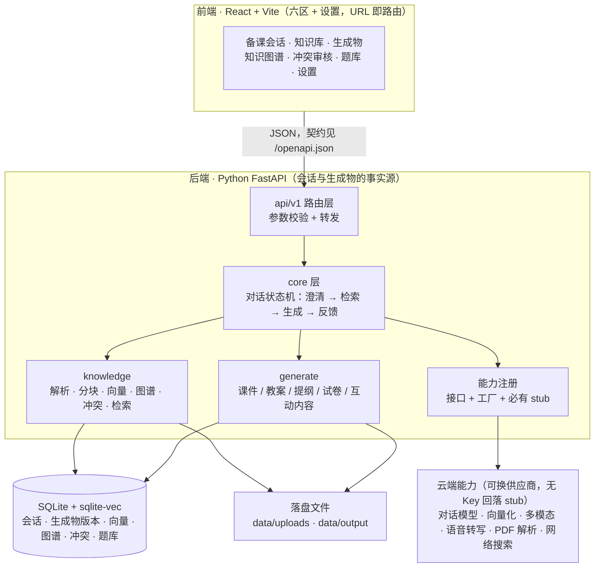

# EduMind — 多模态 AI 互动式教学智能体

以教师教学思路为核心驱动：教师用自然语言（语音/文字）多轮对话备课，系统主动追问澄清意图，融合本地知识库与知识图谱，一键生成 **PPT 课件 / Word 教案 / 教学提纲 / 试卷 / HTML5 互动内容**，并支持修改意见迭代再生成。

## 功能特性

- **多轮对话备课**——语音 + 文字输入，三档追问粒度（快速/标准/精细），主动澄清模糊需求
- **本地知识库**——PDF/Word/PPT/图片/视频/录音 六路解析管道，RAG 语义检索，参考资料溯源
- **知识图谱 + 冲突检测**——从资料自动提取知识点与四种关系（前置/包含/推导/相关）；检测**定义冲突**进入教师待审队列，教师三选一裁决（接受新/保留旧/并存）。结构冲突与常识存疑的**裁决动作与形态已就位，检测尚未实现**（见 ADR-0006）
- **多种生成物一键生成**——课件（三套配色主题）/ Word 教案 / 提纲 / 试卷（自动入题库并标注考查知识点）/ HTML5 互动小游戏
- **迭代优化**——预览当前版本 → 修改意见 → 局部重排再生成 → 下载 .pptx / .docx
- **会话持久化**——多备课会话管理，刷新/重开浏览器完整恢复
- **本地零重依赖**——大模型/PDF 解析/录音转写全部走云端 API，不装 torch、不要 Docker；**无 API Key 时全链路 stub 模式可跑通**

## 系统架构



所有重依赖推至云端（本地零 torch、零 Docker）；一切外部能力必须经「接口 + 工厂 + stub」一层，
换供应商 / 换模型 / 换解析策略只改配置不改代码。**目标架构的一页图与分层职责见 [docs/architecture.md](docs/architecture.md)**。

## 快速开始

**前置依赖**：Python ≥ 3.11、Node.js ≥ 18，推荐安装 [uv](https://docs.astral.sh/uv/)（Python 包管理）。

```bash
git clone https://github.com/JulianZBY/EduMind.git
cd EduMind

# 后端依赖（生成 backend/.venv）
cd backend && uv sync && cd ..

# 前端依赖
cd frontend && npm install && cd ..

# 配置（可跳过：默认 stub 模式，无 Key 即可跑通）
cp backend/.env.example backend/.env    # Windows 用 copy
```

**启动**（开两个终端，Windows / macOS / Linux 命令一致）：

```bash
# 终端 1：后端（:8000）
cd backend && uv run uvicorn app.main:app --host 127.0.0.1 --port 8000

# 终端 2：前端（:5173）
cd frontend && npm run dev
```

浏览器访问 **http://localhost:5173**。

## 接入真实模型（可选）

复制 `backend/.env.example` 为 `backend/.env`，按需填入：

| 变量 | 用途 |
| --- | --- |
| `DASHSCOPE_API_KEY` | 阿里云百炼：qwen LLM / 多模态 / Embedding / paraformer 录音转写 |
| `DEEPSEEK_API_KEY` | DeepSeek（LLM 备选；不支持图片/视频理解，embedding 走 SiliconFlow，缺省时本地兜底向量） |
| `SILICONFLOW_API_KEY` | SiliconFlow（Embedding 备选，托管 bge-large-zh；`LLM_PROVIDER=deepseek` 时生效） |
| `MINERU_TOKEN` | MinerU 云端 PDF 解析 |
| `BOCHA_API_KEY` | 博查网络搜索 |

各 provider 由 `LLM_PROVIDER` / `ASR_PROVIDER` 切换，默认 `stub`（固定内容网关），保证无 Key 环境可跑通全部流程与测试。

> ⚠️ **stub 模式的演示内容与你的输入无关**：知识图谱提取只回显文档前几行作演示节点（带「[stub 演示提取]」标记）；
> 意图分析 / 课件 / 教案 / 试卷 / HTML5 为固定 TCP 演示数据。看到 TCP 主题内容不代表资料被真实解析，接入真实模型后才会基于实际上传内容生成。
> 另外，stub 的意图固定且要素齐全，因此**澄清回复（追问粒度 / 跳过追问）在 stub 下走不到**，
> 冲突队列也不会自然出现冲突——哪些分支在 stub 下不可达、怎么补验证，见 [docs/api/stub-mode.md](docs/api/stub-mode.md)。

## 运行测试与自检

```bash
# 后端：全量测试（无 Key 也能跑；测试自己钉住 stub 档，不受你本机 .env 影响）
cd backend && uv run pytest -q && uv run ruff check .

# 前端：禁用 class 扫描 + lint + 构建
cd frontend && npm run lint && npm run build
```

无 Key 的 stub 全链路冒烟（上传 → 备课对话 → 生成物 → 下载 → 冲突裁决）与
**只有人能做的验收步骤**（真浏览器逐区点选、真实 Key 联通性、人眼视觉项）见
**[docs/acceptance-manual.md](docs/acceptance-manual.md)**。

## 文档地图

| 文档 | 回答什么 |
| --- | --- |
| [CONTEXT.md](CONTEXT.md) | 领域词汇表：面向教师的文案与命名用哪个词（唯一依据） |
| [docs/architecture.md](docs/architecture.md) | 目标架构一页图 + 分层职责 + 现状落差 |
| [docs/api/](docs/api/README.md) | OpenAPI 说不清的协议语义（冲突裁决、生成物取回、stub 模式行为） |
| [docs/adr/](docs/adr/) | 决策记录（事实源、能力注册、冲突类别、前端栈与视觉标准） |
| [docs/style/minimalist-flat.md](docs/style/minimalist-flat.md) | 前端视觉硬标准与交付自检清单（含禁用 class 清单） |
| [docs/acceptance-manual.md](docs/acceptance-manual.md) | 人工验收手册：只有人能做的那些步骤 |
| [backend/AGENTS.md](backend/AGENTS.md) / [frontend/AGENTS.md](frontend/AGENTS.md) | 后端 / 前端的工作规范与命令 |
| `/docs`（Swagger UI）、`/redoc`、`/openapi.json` | 接口的唯一事实源 |
