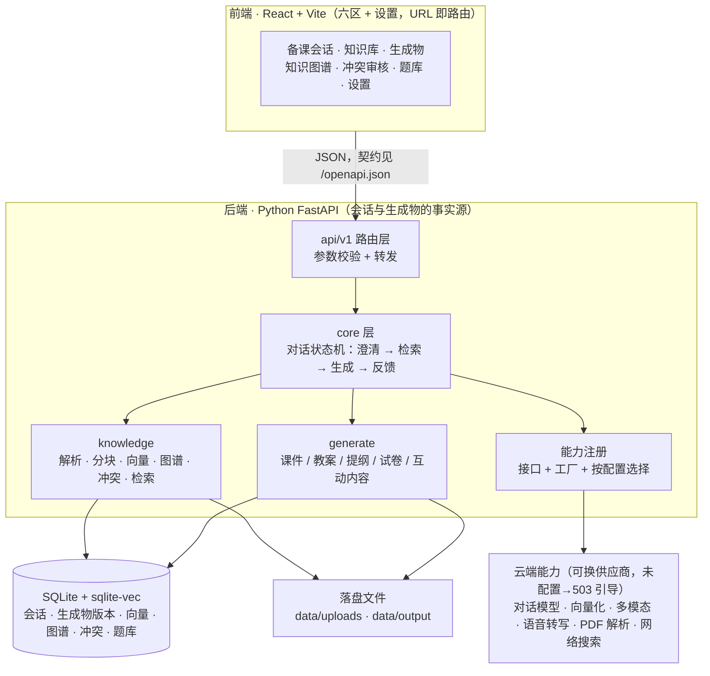

# EduMind — 多模态 AI 互动式教学智能体

以教师教学思路为核心驱动：教师用自然语言（语音/文字）多轮对话备课，系统主动追问澄清意图，融合本地知识库与知识图谱，一键生成 **PPT 课件 / Word 教案 / 教学提纲 / 试卷 / HTML5 互动内容**，并支持修改意见迭代再生成。

## 功能特性

- **多轮对话备课**——语音 + 文字输入，三档追问粒度（快速/标准/精细），主动澄清模糊需求
- **本地知识库**——PDF/Word/PPT/图片/视频/录音 六路解析管道，RAG 语义检索，参考资料溯源
- **知识图谱 + 冲突检测**——从资料自动提取知识点与四种关系（前置/包含/推导/相关）；检测**定义冲突**进入教师待审队列，教师三选一裁决（接受新/保留旧/并存）。结构冲突与常识存疑的**裁决动作与形态已就位，检测尚未实现**（见 ADR-0006）
- **多种生成物一键生成**——课件（三套配色主题）/ Word 教案 / 提纲 / 试卷（自动入题库并标注考查知识点）/ HTML5 互动小游戏
- **迭代优化**——预览当前版本 → 修改意见 → 局部重排再生成 → 下载 .pptx / .docx
- **会话持久化**——多备课会话管理，刷新/重开浏览器完整恢复
- **本地零重依赖**——大模型/PDF 解析/录音转写全部走云端 API，不装 torch、不要 Docker；**云端能力按供应商配置，未配置时给出指向设置页的明确引导（不返回假结果）**

## 系统架构


```mermaid
flowchart TB
    subgraph FE["前端 · React + Vite（六区 + 设置，URL 即路由）"]
        A1["备课会话 · 知识库 · 生成物<br/>知识图谱 · 冲突审核 · 题库 · 设置"]
    end

    subgraph BE["后端 · Python FastAPI（会话与生成物的事实源）"]
        direction TB
        API["api/v1 路由层<br/>参数校验 + 转发"]
        CORE["core 层<br/>对话状态机：澄清 → 检索 → 生成 → 反馈"]
        CAPS["能力注册<br/>接口 + 工厂 + 按配置选择"]
        KNOW["knowledge<br/>解析 · 分块 · 向量 · 图谱 · 冲突 · 检索"]
        GEN["generate<br/>课件 / 教案 / 提纲 / 试卷 / 互动内容"]
    end

    DB[("SQLite + sqlite-vec<br/>会话 · 生成物版本 · 向量 · 图谱 · 冲突 · 题库")]
    FS["落盘文件<br/>data/uploads · data/output"]
    CLOUD["云端能力（可换供应商，未配置→503 引导）<br/>对话模型 · 向量化 · 多模态 · 语音转写 · PDF 解析 · 网络搜索"]

    FE -->|"JSON，契约见 /openapi.json"| API
    API --> CORE
    CORE --> KNOW
    CORE --> GEN
    CORE --> CAPS
    KNOW --> DB
    KNOW --> FS
    GEN --> DB
    GEN --> FS
    CAPS --> CLOUD
```

所有重依赖推至云端（本地零 torch、零 Docker）；一切外部能力必须经「接口 + 工厂 + 按配置选择」一层，
换供应商 / 换模型 / 换解析策略只改配置不改代码。**目标架构的一页图与分层职责见 [docs/architecture.md](docs/architecture.md)**。

## 快速开始

**前置依赖**：Python ≥ 3.11、Node.js ≥ 18，推荐安装 [uv](https://docs.astral.sh/uv/)（Python 包管理）。

```bash
git clone https://github.com/JulianZBY/EduMind.git
cd EduMind

# 后端依赖（生成 backend/.venv）
cd backend && uv sync && cd ..

# 前端依赖
cd frontend && npm install && cd ..

# 配置（先到设置页添加供应商（只选家 + 粘 Key，模型清单自动拉取）或配置 .env，再开始备课；未配置时相关操作返回 503 引导）
cp backend/.env.example backend/.env    # Windows 用 copy
```

**启动**（开两个终端，Windows / macOS / Linux 命令一致）：

```bash
# 终端 1：后端（:8000）
cd backend && uv run uvicorn app.main:app --host 127.0.0.1 --port 8000

# 终端 2：前端（:5173）
cd frontend && npm run dev
```

浏览器访问 **http://localhost:5173**。

## 接入真实模型（可选）

启动后打开 **设置** 页，在「供应商」卡里**添加供应商**（只选家 + 粘 Key，模型清单自动从该家
`/v1/models` 拉取；可同时多家，每家各配各的 Key）：千问（Qwen）、DeepSeek、Kimi、智谱 GLM、
MiniMax、豆包（火山方舟）、硅基流动，或「自定义 OpenAI 兼容服务」（base_url + Key）。
所有已添加供应商的模型合并成统一模型池（每条标注来自哪家）：「全局默认」从池里选一个具体
模型，「任务级模型」可让意图分析 / 生成 / 冲突比对各选一个、未选的跟随全局。

也可以在 `backend/.env` 里预置引导默认（启动时自动迁为一条默认供应商实例），按需填入：

| 变量 | 用途 |
| --- | --- |
| `QWEN_API_KEY` | 千问（Qwen MaaS 官方平台，maas.qianwenaiapi.com）：qwen LLM / 多模态 / Embedding |
| `DEEPSEEK_API_KEY` | DeepSeek（对话 + 多模态：deepseek-flash / deepseek-v4-pro；embedding 该家不提供，走 SiliconFlow 或本地兜底向量） |
| `SILICONFLOW_API_KEY` | SiliconFlow（Embedding 备选，托管 bge-large-zh） |
| `MINERU_TOKEN` | MinerU 云端 PDF 解析 |
| `BOCHA_API_KEY` | 博查网络搜索 |

各家实现由设置页选择（`LLM_PROVIDER` 等 `.env` 变量仅作引导默认）；未配置任何供应商时，
涉及云端能力的操作返回 503 与指向设置页的引导，不返回演示用假结果。

> **未配置时的引导与错误码**见 [docs/api/provider-not-configured.md](docs/api/provider-not-configured.md)：
> 云端能力没配好时相关操作返回 503（`code: provider_not_configured`）与去设置页的引导，
> 产品不返回任何演示用假结果。

## 运行测试与自检

```bash
# 后端：全量测试（无 Key 也能跑；测试用 tests/support 里的替身，离线确定性零成本，不依赖本机 .env）
cd backend && uv run pytest -q && uv run ruff check .

# 前端：禁用 class 扫描 + lint + 构建
cd frontend && npm run lint && npm run build
```

未配置行为冒烟（健康检查 → 503 引导 → 上传解析入库）与全链路冒烟（备课对话 → 生成物 → 下载 → 冲突裁决）、
**只有人能做的验收步骤**（真浏览器逐区点选、真实 Key 联通性、人眼视觉项）见
**[docs/acceptance-manual.md](docs/acceptance-manual.md)**。

## 文档地图

| 文档 | 回答什么 |
| --- | --- |
| [CONTEXT.md](CONTEXT.md) | 领域词汇表：面向教师的文案与命名用哪个词（唯一依据） |
| [docs/architecture.md](docs/architecture.md) | 目标架构一页图 + 分层职责 + 现状落差 |
| [docs/api/](docs/api/README.md) | OpenAPI 说不清的协议语义（冲突裁决、生成物取回、未配置行为、`providers.json` 声明式供应商） |
| [docs/adr/](docs/adr/) | 决策记录（事实源、能力注册、冲突类别、前端栈与视觉标准） |
| [docs/style/minimalist-flat.md](docs/style/minimalist-flat.md) | 前端视觉硬标准与交付自检清单（含禁用 class 清单） |
| [docs/acceptance-manual.md](docs/acceptance-manual.md) | 人工验收手册：只有人能做的那些步骤 |
| [backend/AGENTS.md](backend/AGENTS.md) / [frontend/AGENTS.md](frontend/AGENTS.md) | 后端 / 前端的工作规范与命令 |
| `/docs`（Swagger UI）、`/redoc`、`/openapi.json` | 接口的唯一事实源 |
