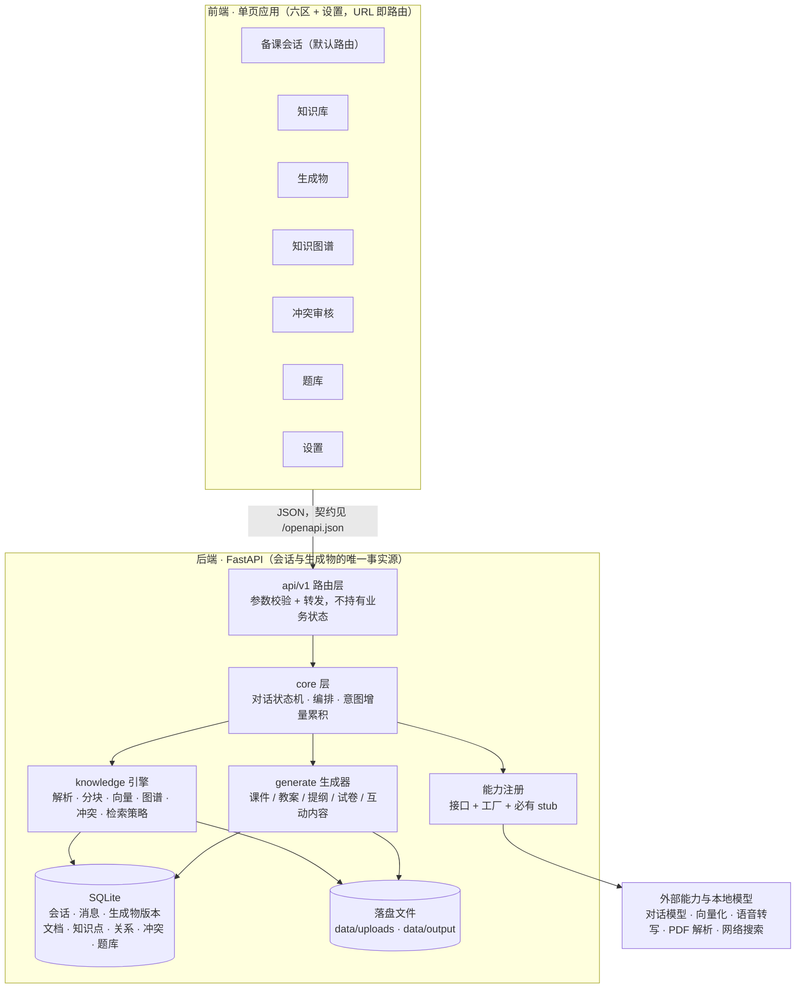

# EduMind 目标架构（一页图）

多模态 AI 备课智能体：教师用多轮对话备课，融合本地教学资料与知识图谱，一键产出课件、教案、提纲、
试卷与互动内容。本页是**目标架构**的单一入口；决策依据见 `docs/adr/`，术语见 `CONTEXT.md`。

## 一页图

> 图读法：前端只认 HTTP 契约；后端唯一的事实源是 SQLite 与 `data/` 落盘文件；
> 一切外部能力都必须经过「接口 + 工厂 + stub」这一层，不允许调用方直接 new 云端客户端。

## 分层与职责

| 层 | 位置 | 只做这些 | 不做这些 |
| --- | --- | --- | --- |
| 前端六区 + 设置 | `frontend/` | 呈现、交互、服务端状态缓存（TanStack Query）、UI 状态（zustand） | 不持有会话事实源，不手抄接口类型 |
| 路由层 | `backend/app/api/` | 参数校验、依赖注入、转发、OpenAPI 注解 | 不写业务逻辑，不持有跨请求状态 |
| 核心层 | `backend/app/core/` | 对话状态机（澄清 → 检索 → 生成 → 反馈）、意图累积、编排、能力工厂 | 不碰 SQL 细节，不掉进具体 provider |
| 知识引擎 | `backend/app/knowledge/` | 文档解析分发、分块、向量检索、图谱、冲突检测、检索/分块策略 | 不生成面向教师的文案 |
| 生成器 | `backend/app/generate/` | 课件 / 教案 / 提纲 / 试卷 / 互动内容的渲染与落盘 | 不做检索决策，不直接调云端 |
| 持久层 | `backend/app/db/` | ORM 模型（字段带中文语义注释）、幂等建表、会话工厂 | 不含业务判断 |
| 能力注册 | `core/*/base.py` + `factory.py` | 接口 + 按配置选择的工厂 + 必有 stub | 向量存储不在此列（单实现，不抽象） |

分层铁律的完整表述见 `backend/AGENTS.md`。

## 六区 + 设置

| 区 | 教师在这里做什么 | 主区形态 | 主要端点（现状 → 目标） |
| --- | --- | --- | --- |
| 备课会话 | 发起备课、回答追问、上传资料、看生成结果 | 二级侧栏（会话列表）+ 对话主轴 | `POST /api/v1/chat` → 会话 CRUD + 消息历史（票 05） |
| 知识库 | 上传教学资料、看解析状态、标记参考资料 | 二级侧栏（资料列表）+ 详情 | `POST /documents/upload`、`GET /documents`（票 09 补详情与状态跟进） |
| 生成物 | 预览 / 下载 / 提修改意见 / 一键试卷 / 互动内容；按会话分组的版本时间线 | 二级侧栏（按会话分组）+ 版本中心 | `POST /exam/generate`、`POST /interactive/generate`、`POST /revise`、`POST /revise/word`、`GET /files/{filename}` → 版本列表/详情/下载（票 07/08） |
| 知识图谱 | 看图谱、按学科章节过滤、点节点看详情、展开邻域 | 主区直铺画布 | `GET /knowledge/graph` → 过滤 / 节点详情 / 邻域子图（票 10） |
| 冲突审核 | 裁决定义冲突、结构冲突、常识存疑 | 主区直铺队列（按类别分区） | `GET /conflicts`、`POST /conflicts/{id}/review` → 三类别与差异化动作（票 11） |
| 题库 | 浏览题目、按考查知识点筛选、看题目详情 | 二级侧栏（题目列表）+ 详情 | 无 → 查询与筛选接口（票 12） |
| 设置 | 选供应商、填 Key、按任务选模型、切能力实现 | 单页表单（编辑密度） | 无 → 设置读写接口（票 13，`.env` 保留为引导默认） |

## 两条主数据流

### 备课一轮（澄清或生成）

1. 前端带着会话 id 与参考资料发起对话；
2. `core` 状态机取累积意图 → 判断是否需要追问：需要则产出**澄清回复**（`clarifying=true`）；
3. 信息够用则检索知识库（参考资料加权）→ 生成器产出课件 / 教案 / 提纲（必要时附互动内容）；
4. 每次产出落一条生成物版本记录 + 落盘文件，二者一一对应；回复里带上命中来源以便溯源。

### 一份资料从上传到入库

1. `POST /documents/upload` 落盘 + 建文档记录 + 立刻返回（状态 `处理中`），解析交后台任务；
2. 解析 → 分块 → 向量化入库 → 抽取知识点与关系 → 冲突检测（冲突进待审队列，审核前新知不入图）；
3. 文档状态落终态 `已完成` / `有冲突` / `失败`；教师在三区分别看到结果。

## 全局约定

- **接口文档 = OpenAPI**：`/openapi.json` 是唯一事实源，Swagger UI 在 `/docs`，ReDoc 在 `/redoc`；
  机器表达不了的协议语义放 `docs/api/`，两者冲突以 OpenAPI 为准。
- **单用户**：固定 `user_id="default"`，无登录、无多租户、无移动端适配。
- **stub 底线**：无任何云端 Key 时全链路必须可跑（见 `docs/api/stub-mode.md`）。
- **能力可换**：换供应商 / 换模型 / 换解析策略只改配置不改代码（ADR-0003）。
- **风格硬标准**：前端任何改动过 `docs/style/minimalist-flat.md` 的自检清单（ADR-0005）。

## 现状与目标（读图时的落差说明）

架构图描述的是**目标态**。截至本页写入时：

- 已实现：备课对话（无状态路径与**会话路径**：会话 / 消息 / 累积意图落库，票 05）、文档上传与后台解析、
  知识库语义检索（两种检索策略按配置选择，票 03）、能力注册统一（票 02）、图谱数据读取、
  试卷 / 互动内容生成、课件与教案修改、冲突列表与三选一裁决、生成物文件下载、
  **生成物全版本留痕**（生成即入库、版本列表 / 详情 / 下载、以历史版本为基线修改，票 07）、
  前端基座（七路由 + 扁平组件库 + OpenAPI 类型管线，票 04）。
- 未实现（按票号）：备课会话与生成物面板（票 06/08）、知识库工作台（票 09）、图谱工作台（票 10）、
  冲突三类别（票 11）、题库查询（票 12）、设置界面（票 13）、端到端验收（票 14）、
  结构冲突与常识存疑的检测逻辑（ADR-0004 只落模型与动作）。

落差以票号为准；与本页冲突时，先看是否有新 ADR 取代了本节所列决策。
