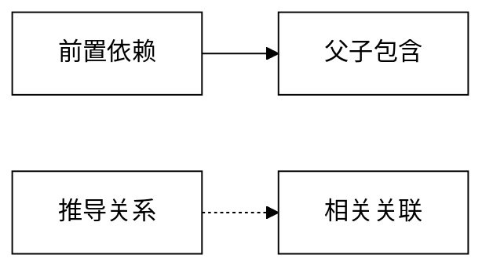

# Minimalist Flat：前端视觉与交互硬标准

本文是**验收硬标准**，不是风格建议。前端任何改动交付前必须逐项过第 7 节自检清单；
第 6 节的禁用 class 清单由扫描脚本在 lint/build 阶段拦截（票 04 落地），违规即构建失败。

适用范围：`frontend/` 的全部界面（六区 + 设置），包含空状态、错误态、弹层、抽屉、图表主题。
不适用：后端生成的课件 / 教案文件（那是教师的交付物，不是产品界面）。

## 1. 色彩

| 角色 | 值 | 用法 |
| --- | --- | --- |
| 前景 / 正文 | 纯黑 `#000000` | 文字、边框、图标、激活态底色 |
| 背景 | 纯白 `#ffffff` | 一切容器与页面底色 |
| 唯一强调色 | `#ff3366` | 当前项标记、关键动作按钮底、图谱关系线、错误与危险提示 |
| 反色 | 黑底白字 / 白底黑字 | 唯一的「选中 / 悬停」表达方式 |

- **零灰底**：不用灰色背景块表达层次或禁用态。层次靠**边线**（`border-2 border-black`）与留白；
  禁用态靠**边框变细（2px → 1px） + 文字色降级为 `text-black/40`**（灰度只作文字色，见下；不使用灰色填充）。
- **强调色上的文字只能是黑色**：`bg-[#ff3366] text-black`。强调色上禁止白字（对比度与硬标准都不允许）。
- **无语义色**：成功 / 失败 / 警告不用红绿蓝，改用「强调色 + 明确文案 + 图标」表达。
- 灰度只允许作为**文字色**的深浅区分（例如说明文字用 `text-black/60`），不得用于 `bg-*` 底色。

## 2. 形状与材质

- 一切容器：`border-2 border-black` + `rounded-none`（直角，零圆角）。
- **零阴影**：不使用 `shadow-*` / `drop-shadow-*` / `box-shadow`。悬停与聚焦不靠「浮起」表达。
- **零渐变**：不使用任何 `bg-gradient-*` 及其色标。
- **零模糊材质**：不使用 `backdrop-blur-*` / 半透明卡片；抽屉与弹层的遮罩用纯黑不透明边框隔断，
  用 `border-2 border-black` 划出面板边界（不做玻璃拟态）。
- 分隔线用 `border-b-2 border-black`（或 `border-r-2`），不用 1px 淡线，不用灰色。

## 3. 交互与状态

- **悬停 = 黑白反色**：`hover:bg-black hover:text-white`（或反向），不做位移、不做缩放、不加阴影。
  **例外（严格限于文本输入类控件）**：`input` / `textarea` 的悬停改为**边线加粗**（`border-2` → `border-4`，
  因 `border-box` 故不产生位移），因为实心黑块会盖住刚输入的内容，反色在输入框上不可读。
  其它一切可交互元素（按钮 / 选项 / 导航 / 列表条目 / 可交互卡片 / 标签页 / 下拉条目）仍必须反色。
- 每个可交互组件必须显式覆盖四态：**默认 / 悬停 / 聚焦（`focus-visible`）/ 禁用**；
  错误态额外一层边框与文案（用强调色）。
- 聚焦必须可见且不使用浏览器默认蓝圈：用 `outline-2 outline-offset-2 outline-black`（或强调色）。
- 键盘可达与焦点陷阱交给 Radix 无头原语（对话框 / 抽屉 / 下拉 / 标签页 / 开关）；
  自建组件只负责扁平皮肤，不重写无障碍行为。
- 破坏性动作（删除会话、删除生成物版本）必须二次确认，确认按钮用强调色底。

## 4. 动效

- 只允许**纯色彩变化**（`transition-colors`），时长 ≤ 200ms。
- 禁止 `transition-all`、`transition-transform`、位移 / 缩放 / 旋转 / 阴影扩散 / 循环动画
  （`animate-spin` 仅允许出现在加载指示器上，且不得使用彩色）。
- 加载态优先用「文字 + 直角进度条（黑底 / 强调色）」，不用骨架屏灰块（灰底违规）。

## 5. 排版与密度

- 字体**自托管**：正文中文 Noto Sans SC，数字与英文标题 Space Grotesk；不引外链字体 CDN。
- 字重只用两档：正文常规 + 标题粗体。不使用斜体、不使用下划线表达强调。
- **密度双轨**：

  | 密度 | 用在哪 | 特征 |
  | --- | --- | --- |
  | 工作台密度 | 会话列表、资料列表、生成物时间线、题目列表、表格、详情表单数据区 | 紧凑行高、贴边分隔线、无装饰留白，一屏尽量多信息 |
  | 编辑密度 | 空状态、设置页、引导与说明、错误页 | 大留白、字号更高一档、单列窄容器，一次只做一件事 |

- 数字与英文统一用 Space Grotesk（等宽感更好，便于对齐版本号、时间、题号）。
- 不用 emoji 装饰；图标用线宽一致的黑白线性图标，不做彩色图标与填充图标。

## 6. 禁用 class 清单（机器扫描）

扫描范围：`frontend/src/**/*.{ts,tsx,css}`。左侧任一正则命中即违规（除非命中右侧「允许例外」）。

| # | 规则 | 正则 | 允许例外 |
| --- | --- | --- | --- |
| 1 | 阴影 | `(?<![\w-])(shadow\|drop-shadow)(-[a-z0-9]+)?` | `shadow-none` |
| 2 | 圆角 | `(?<![\w-])rounded(-[a-z0-9]+)?` | `rounded-none` |
| 3 | 渐变 | `bg-gradient-\|(?:^\|\s)(?:from\|via\|to)-[a-z0-9]+` | 无 |
| 4 | 灰度底色 | `bg-(?:gray\|slate\|zinc\|neutral\|stone)-\d+` | 无 |
| 5 | 半透明底色 | `bg-(?:black\|white)/\d+`、`bg-opacity-\d+` | 无（面板边界用边框，不用遮罩） |
| 6 | 模糊材质 | `backdrop-blur(-[a-z0-9]+)?\|blur-(?:sm\|md\|lg\|xl)` | 无 |
| 7 | 越界过渡 | `transition-all\|transition-transform\|transition-(?:shadow\|filter)` | `transition-colors`、`transition-opacity` |
| 8 | 超时长动效 | `duration-(?:250\|300\|500\|700\|1000)`、`animate-(?:bounce\|pulse\|ping)` | `duration-150`、`duration-200`、`animate-spin`（仅加载指示器） |
| 9 | 非强调彩色 | `(?:bg\|text\|border)-(?:red\|green\|blue\|yellow\|orange\|purple\|pink\|indigo\|teal\|cyan)-\d+` | 无（唯一强调色 `#ff3366` 用任意值写法） |
| 10 | 外链字体 | `fonts\.googleapis\.com\|fonts\.gstatic\.com` | 无 |

约定：强调色统一写成 `bg-[#ff3366]` / `text-[#ff3366]` / `border-[#ff3366]`，
避免被规则 9 误伤，也让 grep 能一次性找出所有强调色使用点。

## 7. 交付自检清单（逐项打勾）

### 形状与材质

- [ ] 全文件无 `shadow-*`（除 `shadow-none`）、无 `drop-shadow-*`
- [ ] 全文件无 `rounded-*`（除显式 `rounded-none`），且容器都写了 `rounded-none`
- [ ] 全文件无 `bg-gradient-*` / `from-*` / `via-*` / `to-*`
- [ ] 全文件无灰度底色（`bg-gray-*` 等）与半透明底色（`bg-black/xx`）
- [ ] 每个容器与卡片都是 `border-2 border-black`

### 色彩

- [ ] 界面只有黑、白、`#ff3366` 三种颜色值
- [ ] 强调色上没有任何非黑文字
- [ ] 成功 / 失败 / 警告状态没有使用红绿蓝，而是强调色 + 文案 + 图标

### 交互与动效

- [ ] 悬停是黑白反色（无位移、无缩放、无阴影）；仅文本输入类控件例外，其悬停为边线加粗
- [ ] 禁用态是「边框 2px → 1px + 文字色 `text-black/40`」，**没有**用 `-webkit-text-stroke` 这类字面描边
  （中文笔画描边后不可读；第 1 节本就允许灰度作为文字色）
- [ ] 可交互组件覆盖默认 / 悬停 / 聚焦 / 禁用四态，聚焦样式可见且非浏览器默认蓝圈
- [ ] 过渡只用 `transition-colors` 且 ≤ 200ms，无 `transition-all`
- [ ] 无循环动画（加载指示器除外）
- [ ] 弹层 / 抽屉 / 下拉 / 标签页用 Radix 无头原语，键盘可完整操作，Esc 可关闭

### 排版与密度

- [ ] 字体自托管（Noto Sans SC + Space Grotesk），无外链字体
- [ ] 数字与英文用 Space Grotesk
- [ ] 数据区采用工作台密度；空状态 / 设置 / 引导采用编辑密度
- [ ] 无 emoji 装饰，图标线宽一致

### 图谱（仅知识图谱区与结构冲突图示）

- [ ] mermaid 采用下述扁平主题配方：白底、黑框直角节点、直角折线
- [ ] 四种关系用黑与强调色的实线 / 虚线区分，不引入其它颜色
- [ ] 节点文字用纯黑，选中节点用强调色描边（不用填充高亮整块）

### 流程

- [ ] 禁用 class 扫描脚本零违规（已在 lint/build 中执行）
- [ ] 页面在空数据、加载中、失败三种状态下都符合本清单（错误态不得退回默认样式）

## 8. mermaid 扁平主题配方（图谱与结构冲突图示共用）

| 关系 | 线型 | 颜色 |
| --- | --- | --- |
| 前置依赖 | 实线 | 黑 `#000000` |
| 父子包含 | 实线（粗） | 黑 `#000000` |
| 推导关系 | 虚线 | 黑 `#000000` |
| 相关关联 | 虚线 | 强调色 `#ff3366` |

- 节点：白底、黑边（2px）、直角（`rounded-none` 等价：mermaid 配置里不使用圆角节点形状）。
- 选中与命中的知识点：改用强调色描边，**不填充色块**（填充会盖住黑字）。
- 禁用 mermaid 默认的彩色分类色板与阴影主题。
